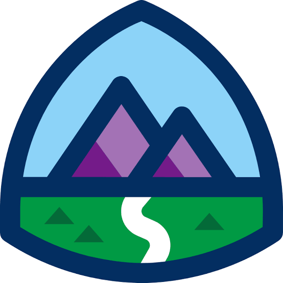

<h1 align="center">Hi 👋 I'm Pitchana Chaikaew</h1>

<h3 align="center">
AI Engineer | LLM • RAG • AI Automation • Full-Stack AI Developer
</h3>

---

### 👩‍💻 About Me

I'm an AI Engineer passionate about building intelligent applications with Large Language Models (LLMs), Retrieval-Augmented Generation (RAG), AI Automation, and Computer Vision.

Currently, I design and develop end-to-end AI solutions, from system architecture and backend development to frontend implementation and deployment.

I enjoy solving real-world business problems with AI and continuously exploring new technologies.

📍 Bangkok, Thailand

📧 pitchana_chk@hotmail.com

🔗 LinkedIn: https://linkedin.com/in/pitchana-chaikaew-bb35342a5

---

## 🛠 Tech Stack

<!-- AI -->

---

### 🤖 AI & Data

- Large Language Models (LLMs)
- Retrieval-Augmented Generation (RAG)
- AI Automation
- Machine Learning
- Computer Vision
- OCR
- Vector Database
- Semantic Search

---

### 🌐 Connect with Me

